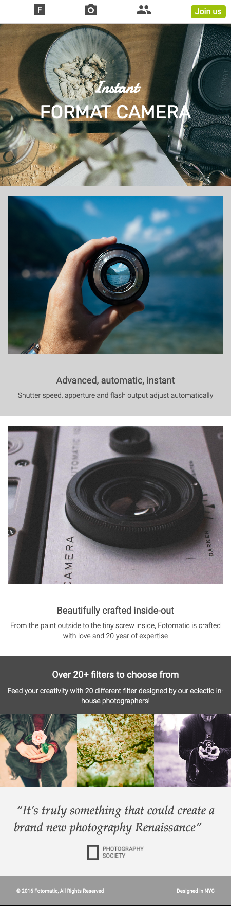

# CodeCademy Project: Fotomatic

This is my solution to the Fotomatic (Fix a broken responsive website) challenge in CodeCademy's Front-End Engineer Course

## Table of contents

- [Overview](#overview)
  - [The challenge](#the-challenge)
  - [Screenshot](#screenshot)
  - [Links](#links)
- [My process](#my-process)
  - [What I learned](#what-i-learned)
  - [Continued development](#continued-development)
  - [Useful resources](#useful-resources)

## Overview

### The challenge

"Project Goals

In this project you will fix a broken version of a responsive website called Fotomatic. You will update it to look and work exactly the same as the specs do. "

-CodeCademy

### Screenshots

Fixed Mobile Site:

Fixed Main Site:

### Links

- Live Site URL: [Fotomatic](https://andyferrie.github.io/Fotomatic/)

## My process

### What I learned

This is my first time converting pixels to rems. I learned about break points for different screen sizes. In the spec there was a cta button in the tablet sized site but the nav menu broke before reaching mobile dimensions so I used the mobile menu in the tablet size. When checking Codecademys final solution I see they did the same.

Moreover, I had some trouble syncing from VS code to Github. I deleted the repository on Github and renamed the project folder but then whenever I opened the new folder it was trying to sync to the deleted repository. I learned that there is a hidden git folder that you need to delete and then you can create a new repository.

### Continued development

I need more practice with responsive design.

### Useful resources

- [TEST CSS FLEXBOX RULES](https://flexbox.help/) - This is a useful resource for quickly checking how flexbox rules are applied.